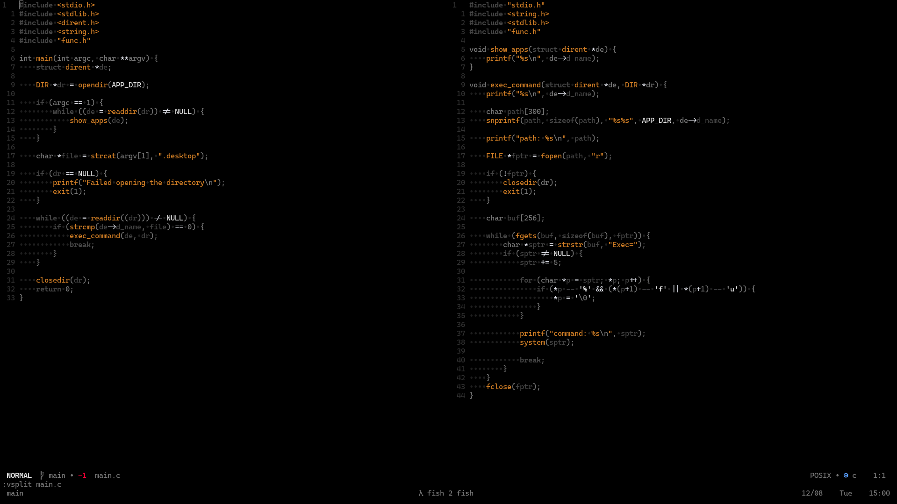

# Oradark.nvim
Simple dark colorscheme for nvim, with a little bit of orange.



## Installation
pckr: 
```lua
require("pckr").add{
    "devEducaua/oradark.nvim",
}
```

paq:
```lua
require "paq" {
    "devEducaua/oradark.nvim",
}
```
